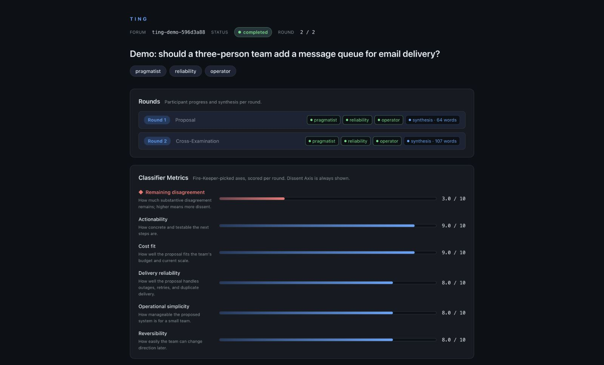

# Ting

**Independent proposals. Cross-examination. A recommendation that keeps the dissent.**

Ting runs structured discussions between AI models and humans. Each participant
proposes a position, critiques another, and revises its thinking. You get a saved
recommendation, the disagreements that remain, and a record of how the discussion
changed.



*An actual screenshot of `ting demo`. Its participants and scores are hand-written
sample data, not live model evaluations.*

## Try it

Build on **macOS or Linux** with [Rust 1.88+](https://rustup.rs/):

```sh
git clone https://github.com/Abeansits/ting.git
cd ting
cargo install --path . --locked
ting demo
```

The demo needs **no API keys, model CLIs, or paid calls**. It prints a sample
recommendation and dissent, then opens the dashboard at `http://127.0.0.1:3420`.
Press Ctrl+C to stop the server; the sample stays on disk for inspection.

Prefer files only? Run `ting demo --output ./my-sample --no-serve`. Existing
folders are never overwritten. Read the [sample output](examples/demo-output.md)
or edit the [sample source](examples/demo-forum.json).

## Run your own discussion

For a live run, install and authenticate **Claude Code** for synthesis and judging,
plus whichever participant CLIs you want to use. Built-in presets include
`claude`, `codex`, `gemini`, `opencode`, `ollama`, and `human`.

```sh
ting doctor --participant codex --participant gemini

ting new "Should our small team add a message queue?" \
  --participant codex --participant gemini --dashboard
```

`doctor` checks executables; authentication and custom commands still need your
inspection. Live runs use your provider accounts and can take several minutes.
Review the [execution, privacy, and cost guide](docs/EXECUTION.md) first: participant
commands inherit your environment and permissions.

After the run, use the forum ID printed by Ting:

```sh
ting list
ting status <forum-id>
ting result <forum-id>
ting result <forum-id> --html
ting serve <forum-id>
```

HTML reports are self-contained and work offline. Publishing is a separate,
explicit `--publish` action; review private context before sharing.

## What makes it useful

- **Structured disagreement:** proposals, assigned critiques, and informed revision.
- **Dissent survives convergence:** enough agreement to stop does not mean unanimity.
- **Bring your tools:** model CLIs, custom commands, local-model participants, or humans.
- **Inspect the evidence:** prompts, responses, claims, and outcomes are ordinary files.
- **Watch progress:** a browser dashboard and an optional Go TUI share the event log.

Ting is useful for architecture choices, planning, and decisions with real
tradeoffs. It is a standalone CLI, and deliberation is slower than a single
response. Agreement among models is not proof that their recommendation is right.

## Explore

- [CLI, presets, human participation, and evaluation](docs/CLI.md)
- [Architecture and session files](docs/ARCHITECTURE.md)
- [Roadmap](ROADMAP.md) · [Changelog](CHANGELOG.md)
- [Contributing](CONTRIBUTING.md) · [Good first issues](https://github.com/Abeansits/ting/labels/good%20first%20issue)
- [Support](SUPPORT.md) · [Security reporting](SECURITY.md)

Small fixes, examples, and thoughtful critiques are welcome. The automated tests
use fake model commands, so you can contribute without paid model accounts.
